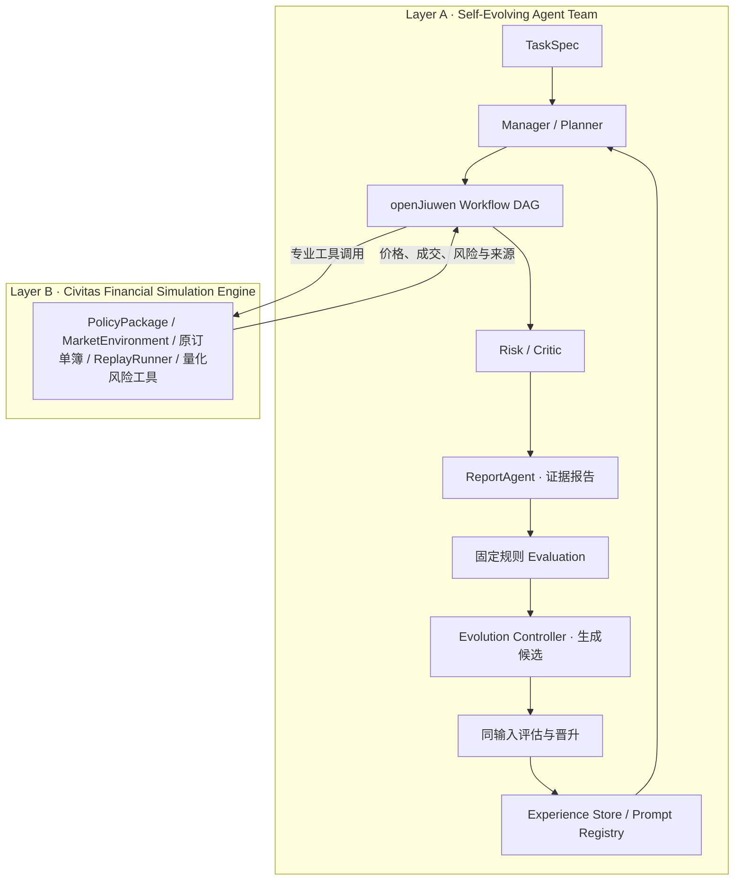

# 启元 Qiyuan-Evo · Civitas Economica

启元 Qiyuan-Evo 是基于 openJiuwen Workflow 的 **Self-Evolving Multi-Agent System（自演进多智能体系统）**，通过执行轨迹与 Critic 反馈联合优化 Prompt、工具策略和团队拓扑。

金融经济政策数字风洞是它的复杂任务验证场景：系统调度原 Civitas 政策编译、市场撮合、历史回放与风险工具，完成政策报告、历史数据分析和监管方案规划。项目面向中国国际大学生创新大赛产业赛道企业命题组，定位为金融政策预评估研究原型。

项目在原 Civitas 系统上增加独立 **Team Evolution Plane**。运行任务后，Critic 指出缺失证据；Evolution Controller 修改 Planner Prompt、工具策略与协作拓扑；同任务同 seed 评估候选，质量严格提高且无审查退化才晋升。下一次运行从 SQLite 经验库读取已晋升配置。三类固定任务和优化前后数据由真实 service 生成。



源码仓库：[DengJunxian/Qiyuan-Evo](https://github.com/DengJunxian/Qiyuan-Evo)。基础金融引擎沿用 [Civitas-Economica-Demo](https://github.com/DengJunxian/Civitas-Economica-Demo)。

启动后默认进入“自演进驾驶舱”。原政策实验、历史验证、研判分析和成果展示入口作为金融政策风洞的业务能力保留。市场参与者的 StrategyGenome / personality evolution 仍属于 Layer B，不计作团队演化。

## 赛题对应与 Agent Roles

完整 30 项 Requirement → Code / Runtime / UI 验收表见 [`FINAL_COMPETITION_READINESS_REPORT.md`](docs/FINAL_COMPETITION_READINESS_REPORT.md)。

| 基础功能角色 | 实际职责与复用位置 | 执行证据 |
|---|---|---|
| Planner / Orchestrator | 扩展 `ManagerAgent.plan_competition_task`，读取执行契约、依赖和经验编号 | TaskPlan、Planner event、消息 |
| Policy Analyst | 调用原 `PolicyPackage` 结构化政策编译 | policy evidence、tool call |
| Simulation Executor | 调用原市场内核或 `ReplayRunner` | 价格、成交、风险 artifact |
| Risk / Critic | 原 `RiskAnalyst` 与 `DiagnosticAgent`，核对完成度与事实 | Critique、失败归因 |
| Reporter | 原 `ReportAgent.synthesize_evidence`，引用工具事实 | evidence / confidence / caveat / source |
| Evolution Controller | 基于反馈生成候选，交由同输入试跑评估 | 独立 controller ExecutionTrace |

初始任务 DAG 为五个角色；Evolution Controller 在任务执行后运行。按任务可新增已注册的 verifier、historian、quant、counterfactual。节点只有实际执行后才计入 Active Agent Count。

## Self-Evolution Loop

`TaskSpec → Planner → Workflow / 专业工具 → Critic → Report → Evaluation → 候选配置 → 同输入试跑 → 晋升或拒绝 → Experience → 下一轮`。

### Prompt Evolution

Planner Prompt 中的版本化 `plan_contract` 是机器可执行的核验指令。Critic 发现缺失对照或复现证据后，优化器补全契约；Planner 与 Executor 在下一次运行解析新 Prompt 内容。版本标签本身不决定行为。保存 old/new Prompt、diff、反馈、前后评价和 accepted/rejected。

本地模式采用规则驱动的契约修复；云端模式使用官方 `FeedbackPromptBuilder.build`，并校验返回契约。Prompt 是配置级演进，不是模型权重训练。

### Tool Evolution

工具统计按任务上下文保存成功率、质量、时延、token 和失败次数。历史分析先探索 `historical_replay`，随后依据已观测质量复用；实际执行器按 `tool_policy.preferred` 选择函数。缓存策略可调整，独立复现实验始终绕过缓存。

### Topology Evolution

缺失证据触发已注册专家加入真实 `AgentTeamConfig`。历史任务将 historian 与 quant 放入同一并行层，Critic 等待两者完成；其他任务重连独立复现或反事实审查路径。SDK 根据新拓扑重新构建 Workflow。保存 before/after，不依赖 UI 改图。

### Experience Memory

SQLite 保存 compact experience：任务指纹、配置、Prompt 版本、工具调用、失败与评审、分数、成本和时延。相似任务按任务类型、数据、模型、约束、评价规则及源码版本检索，优先复用已晋升成功策略；Planner 记录所用经验编号。Baseline 不读取经验。

候选只有质量严格提高、证据和 Critic 无退化、无执行错误才晋升。相同配置收敛后保留“无新变更”的记录，不虚构新一代团队。比较属于固定训练任务验证，尚未建立未知任务泛化或三种机制的独立因果贡献。

## 校赛演示驾驶舱

一级导航：**驾驶舱 → 协作记录 → 演进对照 → 实验案例 → 金融风洞 → 历史验证 → 技术资料**。

首页直接打开已完成的印花税案例：初轮遗漏了哪些验证、哪些成员参与、团队如何调整、两轮用时多少。点击“查看任务与审查记录”，再点击“下一步：查看团队如何调整”，即可检查审查意见、配置变化和复评结果。原金融研究工具保留在侧栏与金融风洞页面。

首页用“完成验证 3/5 → 5/5 项”呈现进展，完整规则评分在两轮对照中。市场产出直接展示政策组与无政策组曲线、历史观测与回放偏差、干预方案风险与成本；零改善和增加的耗时照实保留。

默认案例随源码保存在 `benchmarks/competition/reference/`，打开页面无需联网或调用模型。三个案例来自原生 openJiuwen 工作流的已完成实验，读取时校验文件哈希并核对评分。“重新运行此案例”创建新实验，不改写参考案例。默认规模与当前案例一致（12 个模拟交易日），也可在运行设置中选择 6 日快速规模。运行方式包括本地可复现实验、联网优化、离线备用；后端原始标识与版本在技术资料中展示。

```bash
# 重新生成三类任务的实验归档
python scripts/run_competition_benchmark.py --task all --seed 42 --mode compare --backend openjiuwen --rounds 1 --output outputs/new_reference
# 从归档导出每类任务最早的配对，目标目录须为空
python scripts/package_reference_experiments.py --source outputs/new_reference --destination outputs/reference_preview
# 检查这份归档的界面
QIYUAN_REFERENCE_DIR=outputs/reference_preview streamlit run app.py
# 运行固定种子、6 日快速实验
python scripts/run_competition_demo.py --profile reproducible --task policy_report
```

新的网页实验写入 `outputs/competition_demos/demo-*/`。默认展示优先读取随源码保存的参考案例；`QIYUAN_REFERENCE_DIR` 可指定其他归档目录。显式指定的空目录或损坏文件会显示缺失状态，不使用虚构结果填充。参考案例通过 `reference_manifest.json` 关联文件 SHA-256 和实际实验编号。

每次比较有统一 `experiment_id`。`competition_demo_summary.json` 是 Evidence Bundle 清单：以路径、JSON pointer 和 SHA-256 关联 Baseline/Evolved trace、evaluation、evolution history、Prompt diff、前后 topology、benchmark summary 及 Controller trace。已有 trace 和配对拓扑直接复用，不生成第二套结果。技术页可下载通过哈希校验的 ZIP 包。

浏览器 URL 保存演示编号，刷新后恢复同一后台任务或已完成实验。服务重启后可恢复已落盘结果；中断作业明确标为 InterruptedRun，保留已有 trace，允许重新运行。

图、事件、指标由 ExecutionTrace 与 backend artifact 派生，读取比较时重新核对 TaskSpec、seed、源码/数据哈希和 trace 评分。旧版本产物可回放，但按原配置精确复跑会检查源码身份。SVG 使用本地 `st.iframe`，无 CDN 依赖；后台作业与界面线程分离，页面可在执行期间继续导航。浏览器播放历史记录时明确标注为回放。

## 比赛运行与复现

```bash
git clone https://github.com/DengJunxian/Qiyuan-Evo.git
cd Qiyuan-Evo
python3.12 -m venv .venv
source .venv/bin/activate
pip install -r requirements-lock.txt
python scripts/run_competition_benchmark.py --backend openjiuwen --rounds 3
python -m pytest -q
streamlit run app.py
```

`--backend openjiuwen` 强制真实 SDK；缺包或 API 不兼容时直接报错。`--backend auto` 在 SDK 导入失败时显示 `LOCAL FALLBACK`。Workflow 编排不需要模型密钥：所有任务角色运行确定性专业工具，LLM 配置与编排后端分别显示。

```bash
# 固定 Agent、Prompt、工具策略；不读取经验
python scripts/run_competition_benchmark.py --task policy_report --mode baseline
# 使用已晋升配置、历史经验和工具路由
python scripts/run_competition_benchmark.py --task policy_report --mode evolved
# 训练一个候选，比较后晋升，再运行下一次任务证明配置生效
python scripts/run_competition_benchmark.py --task historical_analysis --mode compare
# 显式本地回退
python scripts/run_competition_benchmark.py --backend local --rounds 1 --output outputs/local_benchmark
# 三类任务都执行指定模式；evolved 从同一输出目录读取经验
python scripts/run_competition_benchmark.py --task all --seed 42 --mode baseline
python scripts/run_competition_benchmark.py --task all --seed 42 --mode evolved
```

默认输出 `outputs/competition_benchmark/`：`summary.json`、`run_trace.json`、`evolution_trace.json`、`evolution_history.json`、`before_after.json`、`team_topology.json`、`prompt_registry.json`、`source_manifest.json`，以及每次运行的隔离仿真结果与日志。数据库保存完整配置和 compact experience。若要独立复现实验初始状态，指定一个新的 `--output` 目录；重复使用目录会读取既有经验，不会清空历史。

| 固定任务 | 专业执行 | 团队演进 |
|---|---|---|
| `policy_report` | PolicyPackage → Civitas 订单簿仿真 → 风险与证据报告 | Planner 增加同 seed 无政策对照与独立复现；增加 verifier |
| `historical_analysis` | 冻结上证指数观测数据 → 条件回放 → 误差与方向检验 | 改用历史回放工具；historian 与 quant 并行执行 |
| `regulatory_planning` | 恐慌场景 → 三种干预 → 原仿真内核 → 预算约束比较 | 增加 counterfactual 专家；保存方案、成本和风险差异 |

任务和评分权重在 [`core/team_evolution/benchmark.py`](core/team_evolution/benchmark.py)，数据快照及来源清单在 [`benchmarks/competition/`](benchmarks/competition/)。质量分由完成度 30%、证据 20%、一致性 20%、任务质量 20%、独立复现 10% 计算。成功还要求所有必需证据齐全、无高严重度 Critique 或未恢复错误。固定 baseline 为通用五角色流水线，未包含任务特有的额外对照/复现任务；该对比衡量任务完成与证据质量，不能等同于金融预测准确率或未知任务泛化。

## openJiuwen 实际调用

[`core/team_evolution/backend.py`](core/team_evolution/backend.py) 直接调用已验证的 `openjiuwen==0.1.17.post1`：`Workflow`、`WorkflowComponent`、`WorkflowCard`、`Start`、`End`、`create_workflow_session`、`Workflow.invoke`。每个任务 Agent 是真实 Workflow 节点，边映射为消息依赖，并行节点由 SDK 的 DAG 运行时调度。每次 trace 记录 package version、实际 invoke/completion 状态。

Prompt 优化默认使用本地可执行契约修复。配置 `QIYUAN_LLM_API_KEY`、`QIYUAN_LLM_BASE_URL` 和 `QIYUAN_LLM_MODEL`，并指定 `--cloud-optimizer` 后，直接调用官方 `FeedbackPromptBuilder.build`；超时、返回无效契约或 API 故障会记录明确回退。无密钥运行不会声称调用 LLM。云端优化器返回文本而无 token usage 时记录 `null`，不估造 token 数。

每次优化调用记录 model、temperature、prompt_version、input hash、timestamp、backend、provider response hash 和最终使用的 response hash；密钥不进入 trace。云端服务实连另需有效密钥，本次验收覆盖原生 Workflow 与受控故障/返回测试。

API 依据：[官方 PyPI 发行包](https://pypi.org/project/openjiuwen/0.1.17.post1/)、[官方 agent-core 仓库](https://github.com/openJiuwen-ai/agent-core)。具体接口已通过安装包源码和真实 Workflow 测试核验。

## 服务与工程边界

[`CompetitionService`](core/competition_service.py) 提供 `run_competition_task`、`run_baseline`、`run_evolved`、`run_before_after`、`rerun_execution`、`get_execution_trace`、`get_team_topology`、`get_evolution_history`、`get_benchmark_summary`、`get_openjiuwen_runtime_info`。UI 只渲染这些返回值。

当前自动拓扑演化支持新增已注册专家、拆分历史分析、并行执行和重连审查路径；未实现任意新角色代码生成、自动合并/退休角色、跨任务元学习或分布式集群。Prompt/工具/拓扑作为联合候选评估，尚无逐因素因果归因。任务角色目前采用确定性规划与专业工具，真实云模型 Prompt 优化需配置密钥另行验证。

历史回放使用冻结的观测行情及前一期真实价格，宏观面板为明确标识的合成假设；属于条件回放，不是未来走势预测。监管推荐按实测回撤和预设成本比较，允许推荐不干预与零风险改善。最终验收、30 项证据表和限制见 [`FINAL_COMPETITION_READINESS_REPORT.md`](docs/FINAL_COMPETITION_READINESS_REPORT.md)；前两阶段记录保留在 [`COCKPIT_VALIDATION.md`](docs/COCKPIT_VALIDATION.md) 与 [`QIYUAN_VALIDATION.md`](docs/QIYUAN_VALIDATION.md)。

---

## 原 Civitas 金融仿真能力

数治观澜是一个面向金融政策预评估与市场演化分析的多智能体仿真平台。项目将自然语言政策、新闻事件、历史行情、异质投资者行为、A 股交易规则和监管动作组织到同一条可复现链路中，用于观察政策冲击如何通过预期、情绪、流动性和订单流传导到市场结果。

项目遵循“LLM 负责解释与结构化，仿真系统负责市场事实”的设计原则。大模型参与政策解析、智能体认知、证据解释和报告摘要；价格路径、成交量、K 线和风险指标由智能体订单、撮合内核、trade tape 与指标计算模块生成。

## 核心能力

- 政策文本结构化：将自然语言政策解析为政策类型、作用对象、强度、时滞、衰减曲线、传导渠道和置信度等可执行字段。
- 多智能体市场推演：构建风险偏好、资金规模、羊群倾向、基准压力和信息处理能力不同的市场主体，并将主体分歧映射为订单意图。
- A 股市场微结构：支持交易时段、开盘集合竞价、连续竞价、涨跌停、最小价格变动、委托延迟、撤单和 K 线聚合等规则。
- 历史验证与事件回放：以上证指数等市场基准为参照，结合历史新闻和事件窗口，评估仿真路径、风险响应和方向一致性。
- 行为金融诊断：输出 CSAD、恐慌度、羊群强度、波动聚集、回撤、微观结构和流动性指标，解释市场变化背后的行为机制。
- 监管反事实分析：对不同干预时机和强度构造对照世界，比较风险、成本、流动性副作用和稳定效果。
- 数据飞轮与事件图谱：支持新闻源、事件存储、GraphML 图结构和种子事件数据，为回放、分析和扩展提供数据底座。
- 结果归档：生成实验摘要、分析报告、图表索引、证据链和可复现元数据，便于后续复盘与研究沉淀。

## 系统架构

| 路径 | 说明 |
| --- | --- |
| `app.py` | Streamlit 前端入口，默认自演进驾驶舱，组织七个比赛页面与原业务能力。 |
| `agents/` | 交易智能体、快慢智能体内核、角色化分析师、认知记忆、群体画像和报告智能体。 |
| `core/` | 市场引擎、撮合内核、历史新闻服务、回测、行为金融、监管沙箱、复现登记、事件存储和模型路由。 |
| `core/exchange/` | A 股交易会话、订单簿、trade tape、K 线聚合以及可选 C++ 撮合扩展。 |
| `engine/` | 仿真循环、智能体调度和市场撮合流程。 |
| `policy/` | 政策结构化解析、事件编译、传导模型和政策引擎。 |
| `ui/` | 政策实验、历史回放、行为诊断、监管优化、报告导出和可视化组件。 |
| `data_flywheel/` | 新闻源接入、文本因子抽取、事件图谱、种子事件存储和数据管线。 |
| `data/` | 政策模板、市场组成、历史新闻缓存、事件图和轻量事件存储。 |
| `demo_scenarios/` | 内置分析场景与历史案例，用于无外部依赖的快速运行。 |
| `theme/`、`static/` | 前端主题、界面配置和静态资源。 |

## 工作流

1. 输入政策文本、选择政策模板或加载内置场景。
2. 政策解析模块生成结构化政策包和传导链。
3. 多智能体系统根据画像、风险偏好、市场状态和政策冲击形成交易意图。
4. 市场内核执行撮合并生成成交记录、价格路径、成交量和 K 线。
5. 评估模块计算路径拟合、事件响应、风险、微观结构和行为金融指标。
6. 监管优化模块运行反事实对照，输出候选干预方案和权衡结果。
7. 归档模块沉淀报告、图表、证据链和复现元数据。

## 默认成果展示

原“成果展示”窗口保留在导航中。该窗口按“政策输入—会话推演—机制解释—反事实评估—历史验证—结果归档”的逻辑，编排项目真实运行界面；点击图片可查看原始尺寸。页面中的默认实验仍可通过内部政策编译、市场推演和因子回测 API 独立复现。

也可以不启动前端，直接运行同一条内部链路并导出 JSON 结果：

```bash
python scripts/run_default_showcase.py
```

默认产物写入 `outputs/default_showcase/default_showcase_run.json`。

## 运行环境

- Python >=3.11,<3.14；本次验证使用 Python 3.12.13。
- Windows、macOS 和 Linux 均可运行，建议使用独立虚拟环境。
- 在线模型 API Key 为可选配置；未配置时系统会进入离线确定性回退链路，核心界面、内置场景和基础分析仍可运行。

## 安装

```bash
python3.12 -m venv .venv
source .venv/bin/activate
python -m pip install --upgrade pip
pip install -r requirements.txt
```

Windows PowerShell：

```powershell
python -m venv .venv
.\.venv\Scripts\Activate.ps1
python -m pip install --upgrade pip
pip install -r requirements.txt
```

如果需要使用锁定依赖环境，可改用：

```bash
pip install -r requirements-lock.txt
```

## 启动

```bash
python -m streamlit run app.py --server.port 8501
```

启动后访问：

```text
http://127.0.0.1:8501
```

也可以通过 `main.py` 进行环境检查后启动界面：

```bash
python main.py
```

## 可选配置

项目会读取本地 `.env` 或 shell 环境变量。`.env` 不应提交到版本库，可参考 `.env.example`：

```bash
DEEPSEEK_API_KEY=your_deepseek_api_key
ZHIPUAI_API_KEY=your_zhipu_api_key
LLM_DEFAULT_PROVIDER=auto
LLM_TIMEOUT_SECONDS=20
LLM_MAX_RETRIES=2
CIVITAS_RANDOM_SEED=42
CIVITAS_INFERENCE_MODE=lite
```

常用配置项：

- `DEEPSEEK_API_KEY`：DeepSeek 在线模型密钥。
- `ZHIPUAI_API_KEY` / `ZHIPU_API_KEY`：智谱在线模型密钥。
- `LLM_DEFAULT_PROVIDER`：模型路由策略，默认 `auto`。
- `CIVITAS_INFERENCE_MODE`：推理档位，可选 `lite`、`standard`、`enterprise`。
- `CIVITAS_DISABLE_SYNTHETIC_MARKET_FALLBACK`：设为 `true` 时，外部行情源失败会直接报错；默认使用合成行情兜底。
- `CIVITAS_LOCAL_MODEL_PATH`：本地推理模型路径。
- `CIVITAS_VLLM_MODEL`：企业档位下的 vLLM 模型名称。

## 可选 C++ 撮合扩展

项目默认可以使用 Python 订单簿回退实现。若需要启用 C++ 限价订单簿扩展，可在安装依赖后执行：

```bash
python setup.py build_ext --inplace
```

扩展不可用时，系统会继续使用 Python 撮合路径或给出明确错误信息，不影响主要功能的使用。

## 数据与产物

- `data/policy_templates.json` 提供政策模板。
- `data/history_news_cache.jsonl`、`data/seed_events.jsonl` 和 `data/event_graph.graphml` 提供历史新闻、种子事件和事件图谱。
- `demo_scenarios/` 提供税费调整、谣言冲击、监管稳定干预和历史案例等内置场景。
- 运行过程中生成的报告、图表和缓存通常写入 `outputs/`、`tmp/`、`artifacts/` 或运行时配置指定目录，这些内容不作为源码提交。

## 快速校验

```bash
python -m compileall -q .
python -c "import app; assert hasattr(app, 'main')"
```

前端校验：

```bash
python -m streamlit run app.py --server.port 8501
```

## 应用边界

本项目适用于金融科技教学、政策冲击研究、复杂系统仿真、行为金融实验和监管方案预评估等场景。系统输出用于分析和研究，不构成投资建议，也不承诺对未来市场价格进行精确预测。
